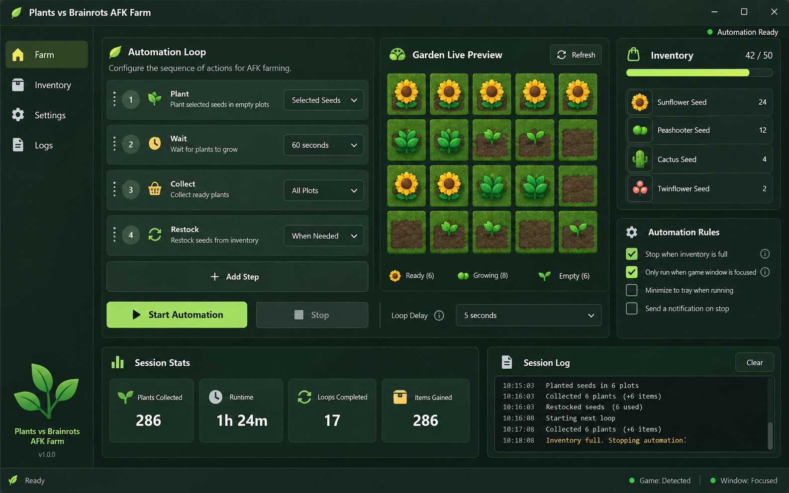

# Plants vs Brainrots AFK Farm Macro

Plan planting and collection loops around the visible game window, with inventory checks and a stop condition when focus or screen state changes.

<a href="./README.md">English</a> · <a href="./README_ES.md">Español</a> · <a href="./README_PT.md">Português</a> · <a href="./README_DE.md">Deutsch</a> · <a href="./README_FR.md">Français</a> · <a href="./README_CN.md">简&#8288;体&#8288;中&#8288;文</a> · <a href="./README_TW.md">繁&#8288;體&#8288;中&#8288;文</a> · <a href="./README_JP.md">日&#8288;本&#8288;語</a> · <a href="./README_KR.md">한&#8288;국&#8288;어</a>

  

## Why this tool exists

An AFK farming loop needs to know when planting is possible, when inventory is full and whether the game window is still active. Each state appears in the loop editor and can stop the session instead of letting inputs continue blindly.

## What it does

### 01 · planting and collection loops

Stores delays and detection settings as reusable profiles instead of loose numbers.

### 02 · inventory-full detection

Shows the exact screen region and state recognized during the current loop.

### 03 · window focus and stop rules

Stops on a limit, lost focus, disconnect or emergency key and records the reason.

## Interface tour

- **01.** Loop editor for Plant, Wait, Collect and Restock steps.
- **02.** Garden preview showing the currently detected plot state.
- **03.** Inventory capacity meter and stop-on-full rule.
- **04.** Window focus and disconnect guards.
- **05.** Session log with collected items, cycles and stop reason.

## At a glance

| Function | What you get |
|---|---|
| **Input** | Timing profile + screen state |
| **What you get** | Controlled input loop |
| **Output** | Profile and session log |

## Built for

- Build a repeatable timing profile
- Catch missed UI states
- Stop safely when conditions change

## How to read the result

Read the live detector before judging the input timing. A missed action with a correct screen state points to delays; a blank or unstable state points to the detection region. Session counters help confirm whether one adjustment improves the whole loop or only moves the failure to another step.

## Before you begin

- Keep **Timing profile + screen state** ready and confirm that it belongs to the intended Plants vs Brainrots (Roblox) profile or session.
- Note the current game/client build or data date before changing a profile.
- Choose where **Profile and session log** will be saved so the previous result is not overwritten.
- Use **planting and collection loops** in one short test first; keep the original save, profile or comparison beside it.

## Data and recovery

Keep the emergency key enabled, cap the first session and save a known-good profile before tuning. Logs should record why the loop stopped, not only how long it ran.

Use automation and game-modification features only where the game rules and session type allow them.

## A complete first run

1. Open **Plants vs Brainrots AFK Farm Macro** and confirm the detected Plants vs Brainrots (Roblox) build or data source.
2. Select the input or profile, then configure **planting and collection loops** without changing the defaults that are not part of this test.
3. Review **inventory-full detection** in the preview or status panel and correct any version, filter or detection warning.
4. Run one controlled action. Compare the visible result with the preview before changing a second setting.
5. Save the profile or export the result, keeping **window focus and stop rules** available for recovery and comparison.

## After a game update

- [ ] Open Live View and confirm every detection region at the current UI scale.
- [ ] Run a short capped session before reusing an unattended profile.
- [ ] Change one delay only after the session log identifies the missed state.
- [ ] Keep the previous profile until catches, stops and focus behavior are confirmed.

## Troubleshooting

> **Common failure pattern:** the loop continues after the inventory is full.

### The loop misses a screen

Open Live View and redraw the detection region at the current resolution and UI scale.

### Inputs continue in another window

Enable the foreground guard and test the emergency hotkey before starting a long session.

### Timing changed after an update

Duplicate the old profile, adjust one delay and compare the session log instead of editing every value.

## Questions

<strong>How does the macro know when to stop?</strong>

The active profile can stop on a detected screen state, a user-set limit, lost focus, disconnect or the emergency hotkey.

<strong>Can the macro guarantee rewards or avoid sanctions?</strong>

No such guarantee is established. Check the game’s rules before using automation. Screen scaling, window focus and UI updates also need testing; keep a stop key available and do not treat AFK as unattended reliability.

<strong>Is a working executable or script included?</strong>

The current repository contains documentation and an interface concept, not a verified working release. Compatibility notes and screenshots are not execution tests. Do not infer official authorship, supported builds or account protection from them.

---

## Download

Review the documented scope and compatibility before choosing a release.

---

